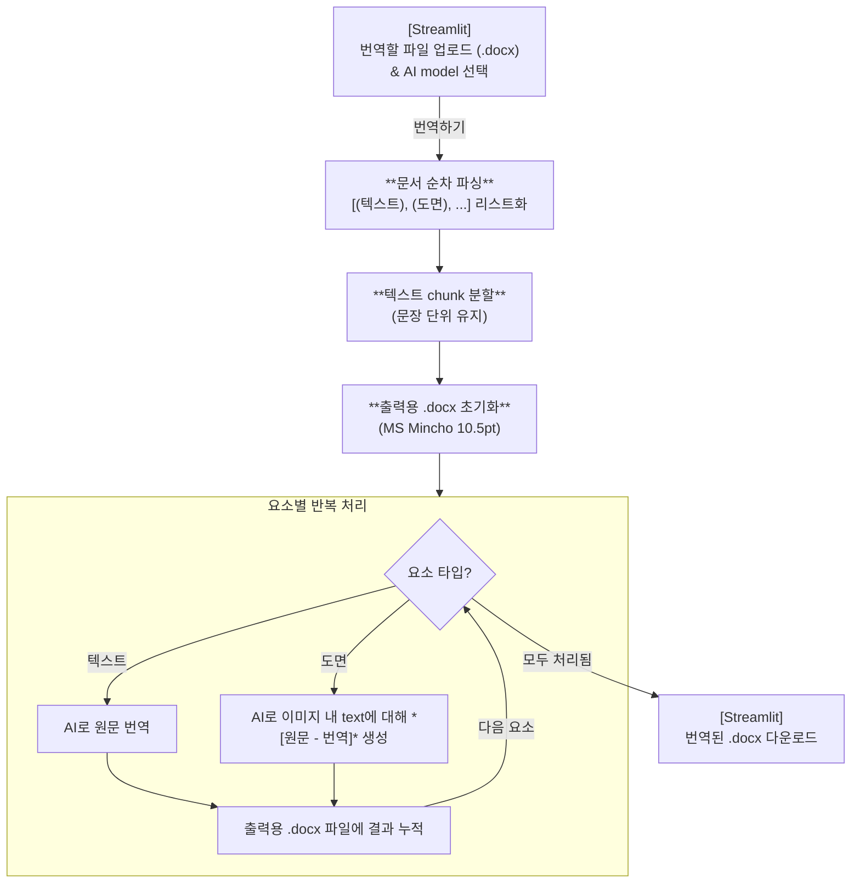

# Pipeline

※ 현재는 사전 사용 안하는 버전 & 비용 이슈로 무료인 Gemini api 사용

## 실행

-   `.streamlit/secrets.toml` 파일 생성
    ```
    GEMINI_API_KEY = "your_gemini_api_key"
    ```
-   앱 실행
    ```
    python -m streamlit run app.py
    ```

## 참고자료
https://ai.google.dev/gemini-api/docs/structured-output?hl=ko&lang=python
