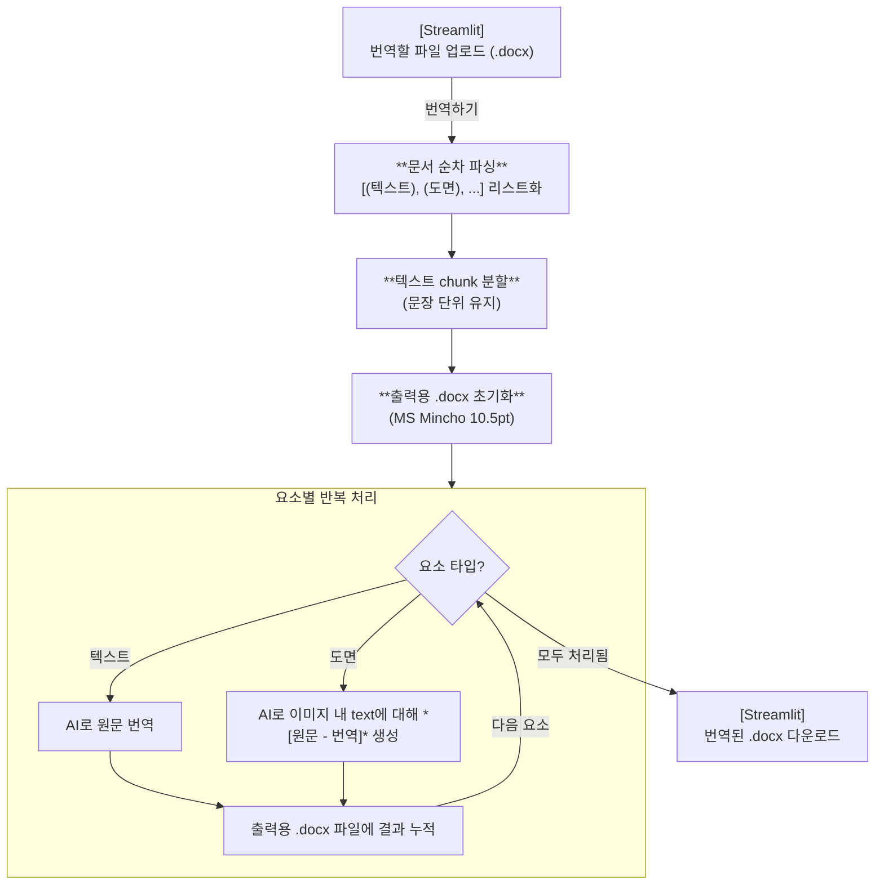

# Service

[](https://ko-jp-patent-translator.streamlit.app/)

# Pipeline


```mermaid
flowchart TD
  A1["[Streamlit]<br>번역할 파일 업로드 (.docx)"]
  A2["**문서 순차 파싱**<br><div style='white-space:nowrap'>[(텍스트), (도면), ...] 리스트화</div>"]
  A3["**텍스트 chunk 분할**<br>(문장 단위 유지)"]
  A4["**출력용 .docx 초기화**<br>(MS Mincho 10.5pt)"]

  subgraph LOOP["요소별 반복 처리"]
    direction TB
    D{"요소 타입?"}
    T["AI로 원문 번역"]
    I["AI로 이미지 내 text에 대해 *[원문 - 번역]* 생성"]
    D -->|텍스트| T --> E
    D -->|도면| I --> E
  end

  E["<div style='white-space:nowrap'>출력용 .docx 파일에 결과 누적</div>"]
  A7["[Streamlit]<br>번역된 .docx 다운로드"]

  %% 흐름
  A1 -->|번역하기| A2 --> A3 --> A4 --> LOOP
  E -->|다음 요소| D
  D -->|모두 처리됨| A7
```

※ Gemini API 유료 Tier 1 사용 중

## 실행

-   `.streamlit/secrets.toml` 파일 생성
    ```
    GEMINI_API_KEY = "your_gemini_api_key"
    ```
-   앱 실행
    ```
    python -m streamlit run app.py
    ```

## 벤치마크 (순차 vs 병렬)

동일 문서로 순차/병렬 번역 소요 시간을 비교하려면:

```bash
export GEMINI_API_KEY="your_key"
python scripts/benchmark_translation.py path/to/patent.docx
```

`--sequential-only` 또는 `--parallel-only` 로 한쪽만 실행할 수 있다. 결과에 순차 시간, 병렬 시간, speedup 배수가 출력된다.

## 참고자료

https://ai.google.dev/gemini-api/docs/structured-output?hl=ko&lang=python
