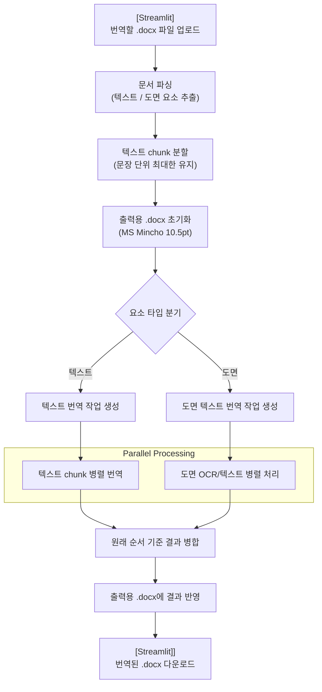
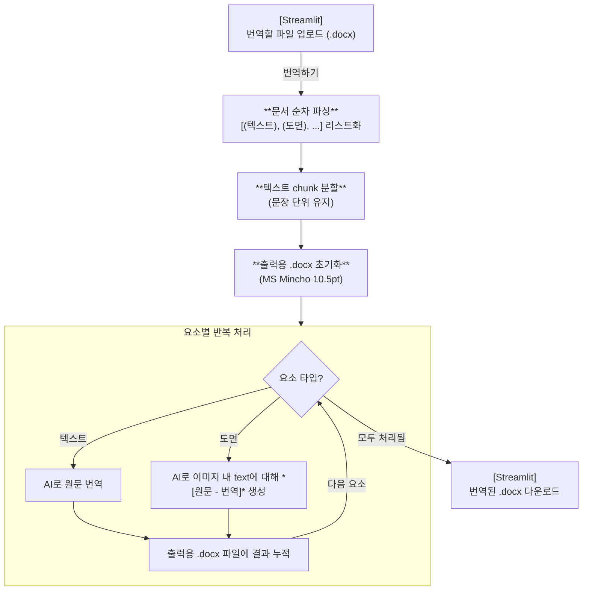

# KO-JP Patent Translator

[](https://ko-jp-patent-translator.streamlit.app/)

한국어 특허 `.docx` 문서를 업로드하면,  
**일본어 특허 문체에 맞춰 번역된 `.docx` 파일**을 다운로드할 수 있는 번역 서비스입니다.

-   입력: `.docx` 특허 문서
-   출력: 일본어 특허 문체의 `.docx`
-   텍스트와 도면(이미지 내 텍스트)을 모두 처리

---

## ✨ Highlights

-   `.docx` 문서를 요소 단위(텍스트 / 도면)로 파싱
-   텍스트는 문장 구조를 최대한 유지하며 chunk 단위로 번역
-   도면 이미지는 OCR성 텍스트 추출 + `[원문 - 번역]` 형식 생성
-   출력 문서는 **MS Mincho 10.5pt** 기준으로 생성
-   **병렬 처리 기반 pipeline**으로 전체 번역 시간 단축

---

## 🚀 Run Locally

1. `.streamlit/secrets.toml` 파일 생성
    ```
    GEMINI_API_KEY = "your_gemini_api_key"
    ```
2. 앱 실행
    ```
    python -m streamlit run app.py
    ```

---

## 🔄 Pipeline Overview

### Parallel (개선)


```mermaid
flowchart TD
  A["[Streamlit]<br/>번역할 .docx 파일 업로드"]
  B["문서 파싱<br/>(텍스트 / 도면 요소 추출)"]
  C["텍스트 chunk 분할<br/>(문장 단위 최대한 유지)"]
  D["출력용 .docx 초기화<br/>(MS Mincho 10.5pt)"]

  E{"요소 타입 분기"}
  T["텍스트 번역 작업 생성"]
  I["도면 텍스트 번역 작업 생성"]

  subgraph P["Parallel Processing"]
    direction TB
    PT["텍스트 chunk 병렬 번역"]
    PI["도면 OCR/텍스트 병렬 처리"]
  end

  M["원래 순서 기준 결과 병합"]
  W["출력용 .docx에 결과 반영"]
  Z["[Streamlit]]<br/>번역된 .docx 다운로드"]

  A --> B --> C --> D --> E
  E -->|텍스트| T --> PT --> M
  E -->|도면| I --> PI --> M
  M --> W --> Z
```

### Sequential (기존)


```mermaid
flowchart TD
  A1["[Streamlit]<br>번역할 파일 업로드 (.docx)"]
  A2["**문서 순차 파싱**<br><div style='white-space:nowrap'>[(텍스트), (도면), ...] 리스트화</div>"]
  A3["**텍스트 chunk 분할**<br>(문장 단위 유지)"]
  A4["**출력용 .docx 초기화**<br>(MS Mincho 10.5pt)"]

  subgraph LOOP["요소별 반복 처리"]
    direction TB
    D{"요소 타입?"}
    T["AI로 원문 번역"]
    I["AI로 이미지 내 text에 대해 *[원문 - 번역]* 생성"]
    D -->|텍스트| T --> E
    D -->|도면| I --> E
  end

  E["<div style='white-space:nowrap'>출력용 .docx 파일에 결과 누적</div>"]
  A7["[Streamlit]<br>번역된 .docx 다운로드"]

  %% 흐름
  A1 -->|번역하기| A2 --> A3 --> A4 --> LOOP
  E -->|다음 요소| D
  D -->|모두 처리됨| A7
```

> [!NOTE]
>
> -   Gemini API 유료 Tier 1 사용 중
> -   AI 번역의 품질 한계로 인해 검수를 통한 후편집 필요

---

## ⏱️ Benchmark Script (순차 vs 병렬)

동일 문서로 순차/병렬 번역 소요 시간을 비교하려면:

```bash
export GEMINI_API_KEY="your_key"
python scripts/benchmark_translation.py path/to/patent.docx
```

옵션:

-   `--sequential-only`
-   `--parallel-only`
    실행 결과에는 순차 시간, 병렬 시간, speedup 배수가 출력됩니다.

### Result (25 청크 특허 문서)

| 구분                 | 소요 시간    |
| -------------------- | ------------ |
| 순차                 | 269.8s       |
| 병렬 (max_workers=8) | 45.6s        |
| **Speedup**          | **약 5.92x** |

---

## 🔗 Reference

https://ai.google.dev/gemini-api/docs/structured-output?hl=ko&lang=python
